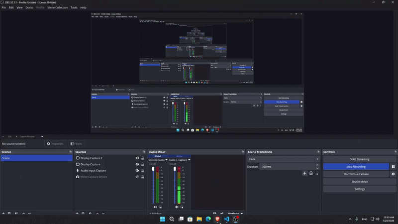

# Local Voice Assistant

A fully local, GPU-accelerated voice assistant with real tool access (Gmail, Google Calendar) via MCP. Speak a question, get a spoken-style response, powered by a local speech pipeline and a cloud LLM with tool-calling.

## Demo



## Features

- **Speech-to-text** — `faster-whisper` running on GPU (CUDA), transcribes what you say
- **Speech-end detection** — Silero VAD detects when you've stopped talking, so you don't need to press a button mid-sentence
- **Conversational memory** — the assistant remembers prior turns in the session
- **Real tool access via MCP** — search/read Gmail, check Google Calendar, all through natural language
- **Web UI** — simple Streamlit interface, click to speak, see the conversation as a chat log

## Architecture

```
Microphone → Silero VAD → faster-whisper (GPU) → LangGraph agent (Groq Llama 3.3 70B) → MCP tools (Gmail, Calendar)
```

| Stage | Tool | Notes |
|---|---|---|
| Speech-to-text | `faster-whisper` | Runs on GPU via CTranslate2, `medium` model |
| Speech-end detection | `silero-vad` | Requires exact 512-sample blocks at 16kHz |
| Reasoning / tool use | LangGraph + Groq (`llama-3.3-70b-versatile`) | Free tier, tool-calling agent |
| Tool access | MCP (Model Context Protocol) | Gmail + Calendar via community MCP servers |
| UI | Streamlit | Click-to-talk, chat-style history |

## Requirements

- Windows 10/11
- NVIDIA GPU with CUDA support (developed on an RTX 3060 12GB)
- Python 3.13
- Node.js (for `npx`-based MCP servers)
- A free [Groq API key](https://console.groq.com)
- A Google Cloud project with Gmail API and Calendar API enabled (for tool access)

## Setup

### 1. Clone / download the project and install Python dependencies

```powershell
pip install faster-whisper sounddevice numpy torch silero-vad
pip install langchain-groq langgraph langchain-core langchain-mcp-adapters
pip install python-dotenv streamlit
pip install nvidia-cublas-cu12 nvidia-cudnn-cu12 nvidia-cuda-runtime-cu12 nvidia-nvjitlink-cu12
```

### 2. Set your Groq API key

Create a `.env` file in the project root:

```
GROQ_API_KEY=your_key_here
```

### 3. Set up Google OAuth (for Gmail + Calendar tools)

1. Create a project at [console.cloud.google.com](https://console.cloud.google.com)
2. Enable the **Gmail API** and **Google Calendar API**
3. Configure the OAuth consent screen (External, add yourself as a test user)
4. Create OAuth credentials (Desktop app type), download the JSON
5. Save it as `gcp-oauth.keys.json` in both:
   ```
   %USERPROFILE%\.gmail-mcp\gcp-oauth.keys.json
   %USERPROFILE%\.calendar-mcp\gcp-oauth.keys.json
   ```
6. Run the auth flow for each server once:
   ```powershell
   npx -y @gongrzhe/server-gmail-autoauth-mcp auth
   npx -y @gongrzhe/server-calendar-autoauth-mcp auth
   ```

### 4. Adjust CUDA DLL paths

`wishper.py` hardcodes DLL paths for the NVIDIA pip packages (needed for `faster-whisper` to find `cublas`/`cudnn` on Windows). Update the `base` path at the top of the file if your Python install location differs from:
```
C:\Users\<you>\AppData\Local\Programs\Python\Python313\Lib\site-packages\nvidia
```

## Running it

**Web UI (recommended):**
```powershell
streamlit run app.py
```
Opens at `localhost:8501`. Click **Speak**, talk, and wait for a response.

**Terminal version:**
```powershell
python the_llm.py
```

## Project structure

```
wishper.py     - STT + VAD (TTS_class: listen_and_transcribe)
the_llm.py     - LangGraph agent, MCP tool wiring, conversation state
app.py         - Streamlit UI
.env           - GROQ_API_KEY (not committed)
```

## Known limitations

- Click-to-talk only — no continuous background listening in the web UI (Streamlit's execution model doesn't support that cleanly)
- Groq free tier has a daily token limit (100k tokens/day); heavy tool use (email bodies, tool schemas) can burn through it fast
- Whisper occasionally mishears uncommon terms/names on short audio clips — increasing `beam_size` or switching to `large-v3` helps
- No text-to-speech yet — responses are text-only in the UI

## Roadmap

- [ ] Add TTS (Piper) so responses are spoken back
- [ ] Move to a fully local LLM (Ollama) for offline operation
- [ ] Add confirmation step before any email-sending tool call
- [ ] Continuous listening mode
